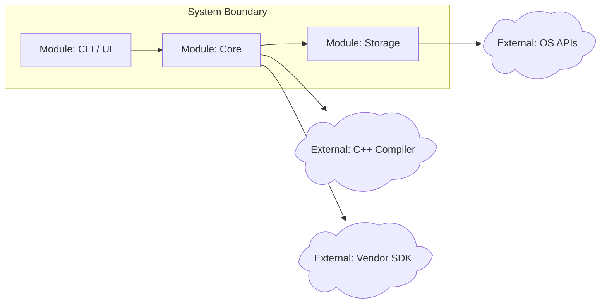
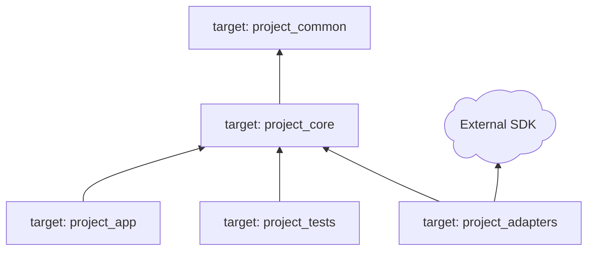
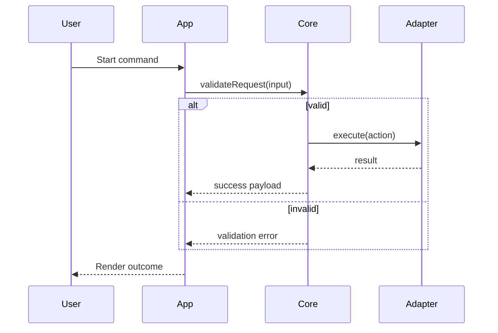

# Artifact Templates

Use these templates to keep the workflow visual, compact, and easy for the user to correct.

## Stage 1: Domain Boundary

Goal: define what the system is, what it depends on, and what is out of scope.

Required user-facing artifacts:

- System boundary and dependency diagram.
- Minimum feature list.
- External dependency table.
- Open decisions table.

Use Mermaid where available:

````markdown

````

If the renderer does not support Mermaid shape syntax, use rounded nodes prefixed with `External:` and keep external dependencies outside the system subgraph.

Dependency table:

```markdown
| Dependency | Why It Exists | Required? | Risk | Default Decision | User Decision |
|---|---|---:|---|---|---|
| CMake >= 3.24 | Build generation | Yes | Low | Keep | ? |
| Vendor SDK | Hardware integration | No | Medium | Decide later | ? |
```

Stage 1 gate question:

```markdown
Please decide only these items: which external dependencies should be removed, kept, or deferred, and which minimum features must enter version one?
```

## Stage 2: Structure Contract

Goal: decide how the project builds and how modules are allowed to depend on each other.

Required user-facing artifacts:

- Project directory tree.
- CMake target dependency diagram.
- Module responsibility table.
- Structure adjustment questions.

Directory tree:

````markdown
```text
project-root/
|-- CMakeLists.txt
|-- cmake/
|-- include/
|   `-- project_name/
|-- src/
|   |-- core/
|   |-- app/
|   `-- adapters/
|-- tests/
`-- docs/
```
````

CMake dependency hierarchy:

````markdown

````

Stage 2 gate question:

```markdown
Reply by node or directory name: move, split, merge, delete, or say "structure accepted".
```

## Stage 3: Flow Orchestration

Goal: convert behavior into visible runtime flows before locking function declarations.

Required user-facing artifacts:

- Swimlane sequence diagram for each important workflow.
- Branch and exception list.
- Function declaration proposal grouped by module.
- Signature review table.

Swimlane sequence diagram:

````markdown

````

Stage 3 gate question:

```markdown
Point to any missing branch, exception, state change, or module interaction in the flow diagram. You can also say "flow accepted, move to function declarations".
```

## Stage 4: Implementation Decision

Goal: let the user choose where to stay involved and where the agent can implement directly.

Required user-facing artifacts:

- Function implementation list as a Markdown table.
- AI/manual/co-author decision column.
- Test expectation column.
- Implementation batch plan after decisions are made.

Implementation table:

```markdown
| Function | Module | Behavior Contract | Tests Needed | AI Implements? | Notes |
|---|---|---|---|---|---|
| parseConfig(path) | core | Load and validate config | Unit: valid/missing/bad format | ? | User decides |
| runPipeline(input) | app | Coordinate validation and execution | Integration: happy path/error path | ? | User decides |
```

Use plain visible markers for uncertain decisions:

- `?` means the user has not decided.
- `AI` means implement automatically.
- `Co-author` means the agent drafts and the user reviews.
- `Manual` means leave a stub, TODO, interface, or documented contract.

Stage 4 gate question:

```markdown
Reply by function name: AI, Co-author, or Manual. Functions you do not mention remain `?` and will not be implemented without a decision.
```

## Open Decisions Block

End each gate reply with a small decision block:

```markdown
**Open Decisions**
| ID | Decision | Recommended Default | Your Reply |
|---|---|---|---|
| D1 | Keep Vendor SDK? | Defer | ? |
```

Once a decision is closed, update the diagram/table and remove it from the blocking list.
