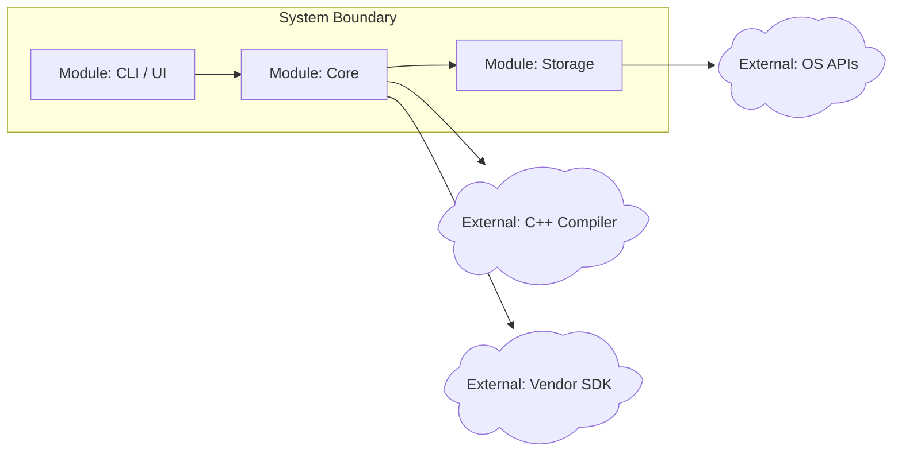
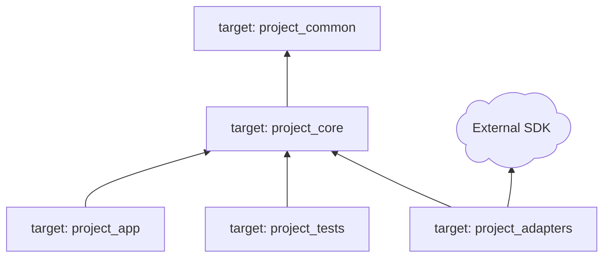
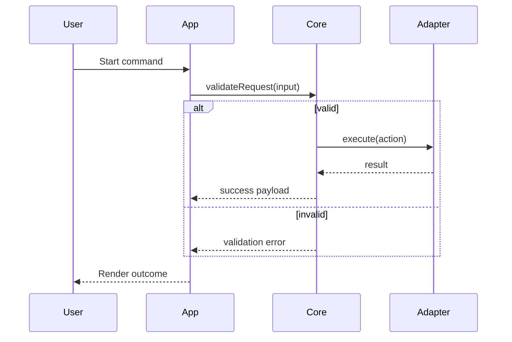

# Artifact Templates

Use these templates to keep the workflow visual, compact, and easy for the user to correct.

## Template Localization Rule

All human-readable text inside these templates, including table cells, node labels, Mermaid comments, and question prompts, is example content only. The agent must localize it to the user's current runtime language when rendering. Stable identifiers such as `F1` and `D1`, function names such as `loadConfig`, paths, target names, commands, and code remain in their source language.

## Native HTML Components

Markdown artifacts may use safe native HTML when visual structure matters. Use these classes instead of inline styles so the bundled renderer can apply themes.

The bundled renderer supports selectable themes. Keep semantic class names stable and avoid hard-coded colors in artifact HTML.

Progress component:

```html
<section class="tlndr-progress" aria-label="Too Long Not Read Progress">
  <div class="tlndr-progress-head">
    <strong>Too Long Not Read Progress</strong>
    <span>Stage 2 of 4</span>
  </div>
  <ol class="tlndr-steps">
    <li class="done"><span>1</span><strong>Domain Boundary</strong><em>Locked</em></li>
    <li class="current"><span>2</span><strong>Structure Contract</strong><em>Current</em></li>
    <li><span>3</span><strong>Flow Orchestration</strong><em>Pending</em></li>
    <li><span>4</span><strong>Implementation Decision</strong><em>Pending</em></li>
  </ol>
</section>
```

State snapshot component:

```html
<section class="tlndr-snapshot" aria-label="State Snapshot">
  <div class="tlndr-snapshot-row locked">
    <span class="tlndr-badge locked">LOCKED</span>
    <strong>Domain</strong>
    <span>ProjectName, Windows/Linux</span>
  </div>
  <div class="tlndr-snapshot-row pending">
    <span class="tlndr-badge pending">PENDING</span>
    <strong>Flow</strong>
    <span>Timeout branch awaiting user input</span>
  </div>
</section>
```

Decision status badges:

```html
<span class="tlndr-badge locked">LOCKED</span>
<span class="tlndr-badge pending">PENDING</span>
<span class="tlndr-badge risk">RISK</span>
<span class="tlndr-badge ai">AI</span>
<span class="tlndr-badge manual">Manual</span>
```

If the host strips HTML, fall back to plain Markdown progress and `[LOCKED]` / `[PENDING]` text blocks.

## Stage Pacing Rule

Render artifacts for one stage at a time. Do not include future-stage artifacts in the same reply or artifact update unless the user explicitly activates Lightning Mode. Later-stage sections may exist as empty placeholders, but their content should remain `Pending`.

## Preview and Confirmed Archive

Keep two Markdown artifacts when the host can write files:

- Current preview: `.tlndr/current.md` or `too-long-not-read-current.md`.
- Confirmed archive: `.tlndr/confirmed.md` or `too-long-not-read-confirmed.md`.

The current preview should contain only:

1. Progress component.
2. Compact state snapshot.
3. Current-stage diagram/table/scenario notes.
4. Current-stage open decisions.
5. Link or path to the confirmed archive.

When a stage is accepted, move its full content to the confirmed archive and remove it from the current preview before rendering the next stage.

Archive link block:

```html
<section class="tlndr-panel">
  <strong>Confirmed Archive</strong>
  <p>Locked decisions moved to <code>.tlndr/confirmed.md</code>.</p>
</section>
```

## Diagram Brevity and Scenario Notes

Keep diagrams compact. A stage diagram should usually fit on one screen and use the smallest number of nodes needed to support the current decision. Move explanatory detail into a scenario note block below the diagram.

Scenario note table:

```markdown
| Scenario | Trigger | Expected Path | User Check |
|---|---|---|---|
| Happy path | Valid input | User -> App -> Core -> Adapter -> Result | Confirm |
| Validation failure | Invalid input | Core returns error before Adapter call | Add missing rule? |
| Timeout | External dependency slow | Adapter timeout branch | Keep, change, or delete? |
```

For non-software domains, replace "Expected Path" with "Outcome" or "Deliverable".

## Initial Intake Prompt

Before Stage 1, ask whether the user already has a written target description. Keep this prompt short and localize it to the user's runtime language:

```markdown
Do you already have a target description? If yes, paste it. If not, describe what you want to build, plan, or produce in one paragraph.
```

If the user already provided a clear target, render an intake row in the artifact and proceed:

```html
<section class="tlndr-panel">
  <strong>Intake</strong>
  <p>Target description received. Proceeding to Stage 1.</p>
</section>
```

## Stage 1: Domain Boundary

Goal: define what the system is, what it depends on, and what is out of scope.

Required user-facing artifacts:

- System boundary and dependency diagram.
- Minimum feature list.
- External dependency table.
- Open decisions table.
- Scenario notes for ambiguous boundary cases.

Use Mermaid where available:

````markdown

````

If the renderer does not support Mermaid shape syntax, use rounded nodes prefixed with `External:` and keep external dependencies outside the system subgraph.

Dependency table:

```markdown
| Dependency | Why It Exists | Required? | Risk | Default Decision | User Decision |
|---|---|---:|---|---|---|
| CMake >= 3.24 | Build generation | Yes | Low | Keep | ? |
| Vendor SDK | Hardware integration | No | Medium | Decide later | ? |
```

Stage 1 gate question:

```markdown
Please decide only these items: which external dependencies should be removed, kept, or deferred, and which minimum features must enter version one?
```

## Stage 2: Structure Contract

Goal: decide how the project builds and how modules are allowed to depend on each other.

Required user-facing artifacts:

- Project directory tree.
- CMake target dependency diagram.
- Module responsibility table.
- Structure adjustment questions.
- Scenario notes for common layout decisions.

Directory tree:

````markdown
```text
project-root/
|-- CMakeLists.txt
|-- cmake/
|-- include/
|   `-- project_name/
|-- src/
|   |-- core/
|   |-- app/
|   `-- adapters/
|-- tests/
`-- docs/
```
````

CMake dependency hierarchy:

````markdown

````

Stage 2 gate question:

```markdown
Reply by node or directory name: move, split, merge, delete, or say "structure accepted".
```

## Stage 3: Flow Orchestration

Goal: convert behavior into visible runtime flows before locking function declarations.

Required user-facing artifacts:

- Swimlane sequence diagram for each important workflow.
- Branch and exception list.
- Function declaration proposal grouped by module.
- Signature review table.
- Scenario notes below each flow diagram.

Swimlane sequence diagram:

````markdown

````

Stage 3 gate question:

```markdown
Point to any missing branch, exception, state change, or module interaction in the flow diagram. You can also say "flow accepted, move to function declarations".
```

## Stage 4: Implementation Decision

Goal: let the user choose where to stay involved and where the agent can implement directly.

Required user-facing artifacts:

- Function implementation list as a Markdown table.
- AI/manual/co-author decision column.
- Test expectation column.
- Implementation batch plan after decisions are made.

Implementation table:

```markdown
| Function | Module | Behavior Contract | Tests Needed | AI Implements? | Notes |
|---|---|---|---|---|---|
| parseConfig(path) | core | Load and validate config | Unit: valid/missing/bad format | ? | User decides |
| runPipeline(input) | app | Coordinate validation and execution | Integration: happy path/error path | ? | User decides |
```

Use plain visible markers for uncertain decisions:

- `?` means the user has not decided.
- `AI` means implement automatically.
- `Co-author` means the agent drafts and the user reviews.
- `Manual` means leave a stub, TODO, interface, or documented contract.

Stage 4 gate question:

```markdown
Reply by function name: AI, Co-author, or Manual. Functions you do not mention remain `?` and will not be implemented without a decision.
```

## Open Decisions Block

End each gate reply with a small decision block:

```markdown
**Open Decisions**
| ID | Decision | Recommended Default | Your Reply |
|---|---|---|---|
| D1 | Keep Vendor SDK? | Defer | ? |
```

Once a decision is closed, update the diagram/table and remove it from the blocking list.
