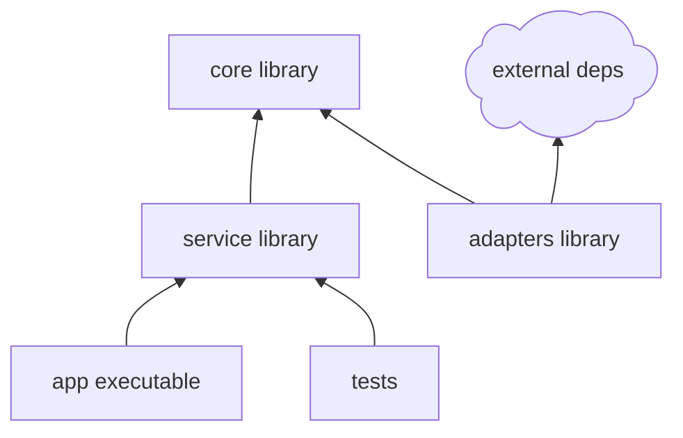

# C/C++ Project Guidance

Use this reference when the project is or may become a CMake project.

## Compile Contract First

Before proposing C++ classes or function bodies, define the build contract:

- Minimum CMake version.
- C++ standard.
- Supported platforms and compilers.
- Library/executable/test targets.
- Public and private include boundaries.
- External package discovery strategy: `find_package`, vendored dependency, `FetchContent`, package manager, or user-provided path.
- Test framework and how tests are invoked.

Recommended compact table:

```markdown
| Build Choice | Recommendation | Reason | User Decision |
|---|---|---|---|
| CMake version | 3.24+ | Good preset and modern target support | ? |
| C++ standard | C++20 | Strong defaults for new code | ? |
| Tests | Catch2 or GoogleTest | Depends on repo convention | ? |
```

## Target Rules

Prefer modern target-based CMake:

- Use target names as architectural nodes.
- Express dependencies with `target_link_libraries`.
- Keep include directories target-scoped.
- Avoid global include/link flags unless the repository already uses them.
- Separate stable libraries from executable entry points.
- Keep adapters and platform bindings depending inward on core contracts, not the reverse.

Typical target layers:



## Structure Questions

Ask these only when not already answered:

- Is the first version a CLI, GUI, library, service, or mixed project?
- Does it need Windows/Linux/macOS support in version one?
- Are external dependencies allowed, or should the first version use only the standard library?
- Should tests be created from the beginning?
- Should public headers be stable API, or internal-only for now?

## Validation

When implementation begins, validate with the least expensive meaningful checks available:

- Configure step: `cmake -S . -B build`.
- Build step: `cmake --build build`.
- Test step: `ctest --test-dir build` when tests exist.

If dependencies are intentionally missing or platform-specific, report the exact unresolved dependency and keep the build contract explicit instead of silently weakening the architecture.
