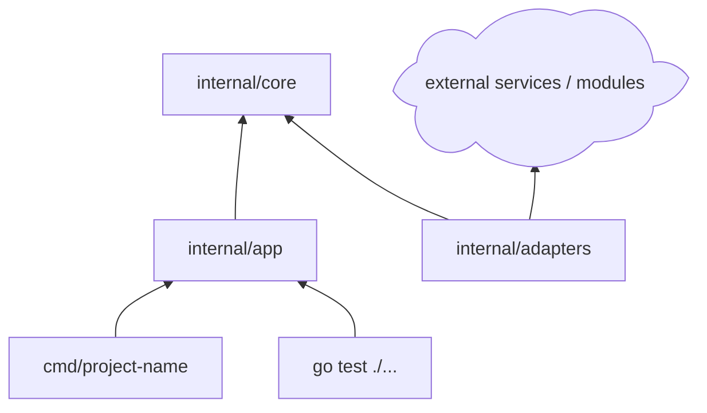

# Go Project Guidance

Use this reference when the project is or may become a Go CLI, service, API backend, worker, library, or multi-command tool.

## Module Contract First

Before proposing packages or function bodies, define the Go module contract:

- Go version in `go.mod`.
- Module path.
- Application type: command, HTTP API, worker, library, or mixed project.
- Package boundaries: `cmd/`, `internal/`, public packages, adapters.
- Dependency policy: standard library first, selected third-party packages, or existing stack.
- Context and cancellation strategy.
- Test strategy and integration boundaries.

Recommended compact table:

```markdown
| Project Choice | Recommendation | Reason | User Decision |
|---|---|---|---|
| Go version | 1.22+ | Modern standard library and toolchain support | ? |
| Layout | `cmd/` + `internal/` | Keeps app entry points separate from internals | ? |
| Error model | wrapped errors with sentinel or typed errors | Idiomatic and inspectable | ? |
| Tests | `go test ./...` | Native and lightweight | ? |
```

## Structure Rules

Use a simple layout unless the project clearly needs multiple commands or public packages.

```text
project-root/
|-- go.mod
|-- cmd/
|   `-- project-name/
|       `-- main.go
|-- internal/
|   |-- core/
|   |-- app/
|   `-- adapters/
|-- pkg/
`-- docs/
```

Typical package dependency layers:



## Function Contracts

For Go functions, include:

- Package path.
- Exported or internal status.
- `context.Context` requirement.
- Error return behavior.
- Interface ownership: define interfaces near consumers unless the project convention differs.
- Test table expectations.

Signature table:

```markdown
| ID | Package | Declaration | Responsibility | Error Model | User Decision |
|---|---|---|---|---|---|
| F1 | `internal/core/config` | `func LoadConfig(path string) (Config, error)` | Load and validate config | Wrapped error | ? |
| F2 | `internal/app` | `func Run(ctx context.Context, req Request) (Result, error)` | Orchestrate execution | Context-aware error | ? |
```

## Validation

Use Go-native checks:

- Format: `gofmt -w` before final handover when editing files.
- Tests: `go test ./...`
- Vet: `go vet ./...`
- Run: `go run ./cmd/project-name`
- Build: `go build ./...`

Avoid creating large framework-style layouts unless the user asks for them or the repository already uses them.
