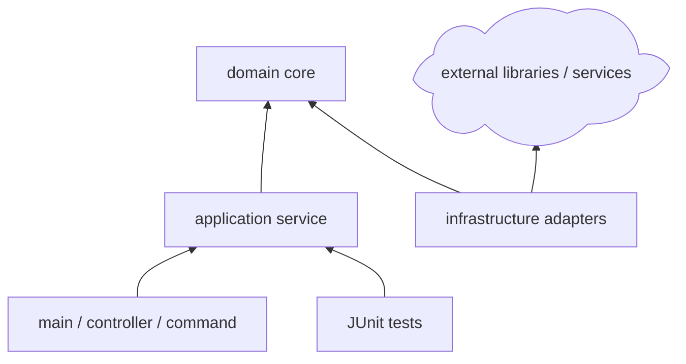

# Java Project Guidance

Use this reference when the project is or may become a Java CLI, library, service, Spring Boot backend, desktop tool, or multi-module JVM project.

## Build Contract First

Before proposing packages or function bodies, define the Java build contract:

- Java version.
- Build tool: Maven, Gradle, or existing wrapper.
- Project shape: single module, multi-module, CLI, service, library, or Spring Boot application.
- Package namespace.
- Dependency scope: implementation, runtime, test, annotation processors.
- Error and exception strategy.
- Test framework and integration test boundary.

Recommended compact table:

```markdown
| Project Choice | Recommendation | Reason | User Decision |
|---|---|---|---|
| Java version | 17 or 21 LTS | Stable long-term baseline | ? |
| Build tool | Existing wrapper, otherwise Maven or Gradle | Match repo first | ? |
| Tests | JUnit 5 | Standard JVM test baseline | ? |
| App shape | CLI, library, or Spring Boot | Depends on runtime target | ? |
```

## Structure Rules

For Maven:

```text
project-root/
|-- pom.xml
|-- src/
|   |-- main/
|   |   `-- java/
|   |       `-- com/example/project/
|   `-- test/
|       `-- java/
`-- docs/
```

For Gradle:

```text
project-root/
|-- build.gradle.kts
|-- settings.gradle.kts
|-- src/
|   |-- main/java/
|   `-- test/java/
`-- docs/
```

Typical module/package layers:



## Function Contracts

For Java methods, include:

- Package and class.
- Public, package-private, protected, or private visibility.
- Static versus instance ownership.
- Exception behavior: checked exception, unchecked exception, result object, optional, or framework response.
- Nullability and validation rules.
- Test class expectation.

Signature table:

```markdown
| ID | Class | Declaration | Responsibility | Error Model | User Decision |
|---|---|---|---|---|---|
| F1 | `ConfigLoader` | `public Config load(Path path)` | Load and validate config | Throws `ConfigException` | ? |
| F2 | `JobService` | `public JobResult run(JobRequest request)` | Orchestrate job execution | Throws domain exception | ? |
```

## Validation

Use the detected build wrapper when present:

- Maven test: `./mvnw test` or `mvn test`.
- Maven package: `./mvnw package`.
- Gradle test: `./gradlew test`.
- Gradle build: `./gradlew build`.
- Spring Boot run: `./mvnw spring-boot:run` or `./gradlew bootRun`.

Do not introduce Spring Boot, Lombok, MapStruct, or other heavy dependencies unless the user asks for them or the existing project already uses them.
