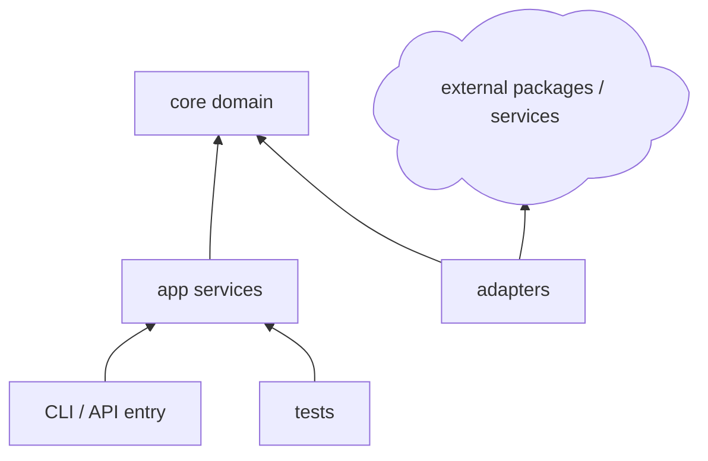

# Node and TypeScript Project Guidance

Use this reference when the project is or may become a Node.js, TypeScript, frontend tooling, CLI, API service, library, or full-stack JavaScript project.

## Package Contract First

Before proposing modules or function bodies, define the package contract:

- Runtime: Node.js, browser, edge runtime, or mixed.
- Language: JavaScript, TypeScript, or both.
- Package manager: npm, pnpm, yarn, bun, or existing lockfile.
- Module system: ESM, CommonJS, or dual package.
- Application type: CLI, API, library, worker, frontend, or monorepo.
- Dependency groups: dependencies, devDependencies, peerDependencies, optionalDependencies.
- Build, test, lint, and type-check scripts.

Recommended compact table:

```markdown
| Project Choice | Recommendation | Reason | User Decision |
|---|---|---|---|
| Language | TypeScript | Better contracts for agent/user review | ? |
| Module system | ESM | Modern Node default for new projects | ? |
| Package manager | Existing lockfile, otherwise pnpm or npm | Match repo first | ? |
| Tests | Vitest or Node test runner | Depends on dependency policy | ? |
```

## Structure Rules

For a CLI, API, or library:

```text
project-root/
|-- package.json
|-- tsconfig.json
|-- src/
|   |-- index.ts
|   |-- core/
|   |-- app/
|   `-- adapters/
|-- tests/
`-- docs/
```

For a monorepo:

```text
project-root/
|-- package.json
|-- pnpm-workspace.yaml
|-- packages/
|   |-- core/
|   |-- app/
|   `-- adapters/
|-- apps/
`-- docs/
```

Typical package dependency layers:



## Function Contracts

For JavaScript and TypeScript functions, include:

- Module path.
- Exported or internal status.
- Type signature or JSDoc contract.
- Error model: thrown error, result object, rejected promise, framework response.
- Async boundary and cancellation/abort behavior.

Signature table:

```markdown
| ID | Module | Declaration | Responsibility | Error Model | User Decision |
|---|---|---|---|---|---|
| F1 | `src/core/config.ts` | `export function loadConfig(path: string): Config` | Load and validate config | Throws `ConfigError` | ? |
| F2 | `src/app/run.ts` | `export async function runJob(input: JobInput): Promise<JobResult>` | Orchestrate job execution | Rejects with typed error | ? |
```

## Validation

Choose commands from the detected package manager:

- Install: `npm install`, `pnpm install`, `yarn install`, or `bun install`.
- Type check: `npm run typecheck` or equivalent.
- Test: `npm test` or equivalent.
- Lint: `npm run lint` when configured.
- Build: `npm run build`.
- Run CLI/API: use the package scripts instead of inventing commands.

If no package manager is locked, ask before adding one unless the user granted autonomy.
