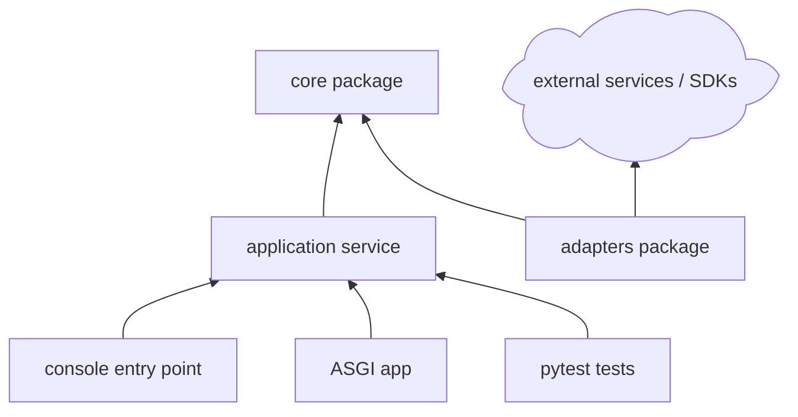

# Python Project Guidance

Use this reference when the project is or may become a Python package, CLI, service, automation tool, data pipeline, or FastAPI backend.

## Project Contract First

Before proposing modules or function bodies, define the packaging and runtime contract:

- Python version range.
- Packaging file: `pyproject.toml`, `setup.py`, or existing convention.
- Application type: package, CLI, API service, worker, notebook-adjacent pipeline, or library.
- Dependency groups: runtime, dev, test, optional extras.
- Entry points: console scripts, ASGI app path, module runner, or importable API.
- Environment strategy: virtualenv, uv, pip, poetry, hatch, conda, or existing tooling.
- Test framework and quality tools.

Recommended compact table:

```markdown
| Project Choice | Recommendation | Reason | User Decision |
|---|---|---|---|
| Python version | 3.11+ | Good ecosystem support and typing improvements | ? |
| Package metadata | `pyproject.toml` | Modern packaging standard | ? |
| Tests | pytest | Common and concise | ? |
| Type checks | mypy or pyright | Depends on project strictness | ? |
```

## Structure Rules

Prefer a `src/` layout for packages and libraries unless the repository already uses a flat layout.

```text
project-root/
|-- pyproject.toml
|-- src/
|   `-- project_name/
|       |-- __init__.py
|       |-- core/
|       |-- app/
|       `-- adapters/
|-- tests/
|-- scripts/
`-- docs/
```

Typical dependency layers:



## Function Contracts

For Python functions, include:

- Module path.
- Public or internal status.
- Type hints.
- Error model: exception, `Result`-style object, `None`, status enum, or framework exception.
- Sync/async boundary.
- Test fixture expectations.

Signature table:

```markdown
| ID | Module | Declaration | Responsibility | Error Model | User Decision |
|---|---|---|---|---|---|
| F1 | `project_name.core.config` | `def load_config(path: Path) -> Config:` | Load and validate config | Raises `ConfigError` | ? |
| F2 | `project_name.app.service` | `async def run_job(request: JobRequest) -> JobResult:` | Orchestrate job execution | Returns typed result | ? |
```

## Validation

Choose commands from the detected toolchain:

- Install/check: `python -m pip install -e .`
- Test: `python -m pytest`
- Type check: `python -m mypy src` or `pyright`
- Run CLI: `python -m project_name` or generated console command.
- Run FastAPI: `uvicorn project_name.api:app --reload`

If the user wants a no-dependency first version, keep the initial contract standard-library-only and mark framework integration as deferred.
