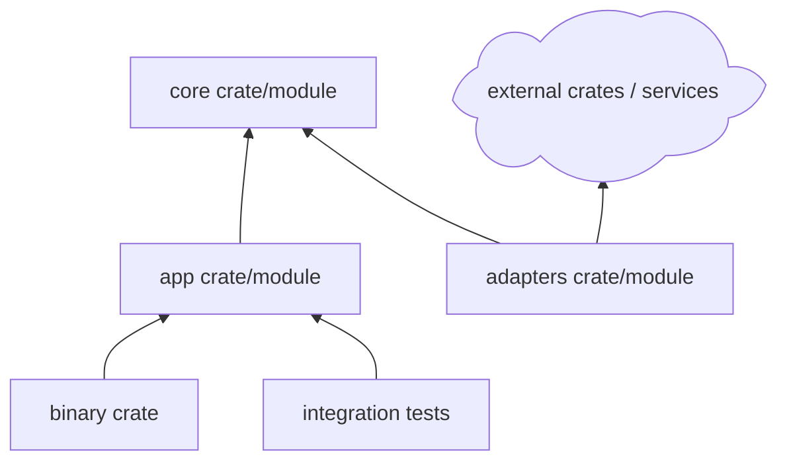

# Rust Project Guidance

Use this reference when the project is or may become a Rust CLI, library, service, systems tool, WebAssembly module, or multi-crate workspace.

## Cargo Contract First

Before proposing modules or function bodies, define the Cargo contract:

- Rust edition.
- Minimum supported Rust version when relevant.
- Crate shape: binary, library, mixed crate, or workspace.
- Feature flags and optional dependencies.
- Runtime model: sync, async, Tokio, async-std, or no runtime.
- Error strategy: `thiserror`, `anyhow`, custom enum, or standard errors.
- Test strategy: unit tests, integration tests, doctests, property tests.

Recommended compact table:

```markdown
| Project Choice | Recommendation | Reason | User Decision |
|---|---|---|---|
| Edition | 2021 or 2024 | Match toolchain and dependency support | ? |
| Crate shape | binary + library | Keeps CLI thin and logic testable | ? |
| Error model | `thiserror` for libraries, `anyhow` for binaries | Clear boundary between API and app | ? |
| Tests | unit + integration | Rust tooling supports both well | ? |
```

## Structure Rules

For a small CLI or service:

```text
project-root/
|-- Cargo.toml
|-- src/
|   |-- main.rs
|   |-- lib.rs
|   |-- core/
|   |-- app/
|   `-- adapters/
|-- tests/
`-- docs/
```

For larger systems, prefer a workspace:

```text
project-root/
|-- Cargo.toml
|-- crates/
|   |-- project-core/
|   |-- project-app/
|   `-- project-adapters/
|-- tests/
`-- docs/
```

Typical crate dependency layers:



## Function Contracts

For Rust functions, include:

- Module or crate path.
- `pub`, `pub(crate)`, or private visibility.
- Ownership and borrowing expectations.
- Error type and `Result` shape.
- Sync/async boundary.
- Trait boundaries when adapters are involved.

Signature table:

```markdown
| ID | Module | Declaration | Responsibility | Error Model | User Decision |
|---|---|---|---|---|---|
| F1 | `core::config` | `pub fn load_config(path: &Path) -> Result<Config, ConfigError>` | Load and validate config | Typed error enum | ? |
| F2 | `app::runner` | `pub async fn run_job(req: JobRequest) -> Result<JobResult, AppError>` | Orchestrate job execution | App-level error | ? |
```

## Validation

Use Cargo-native checks:

- Format: `cargo fmt --check`
- Static check: `cargo check`
- Tests: `cargo test`
- Lint: `cargo clippy -- -D warnings` when the project opts into strict linting.
- Run: `cargo run -- <args>` for binaries.

If external crates are not allowed, record that as a locked dependency decision and avoid suggesting helper crates.
